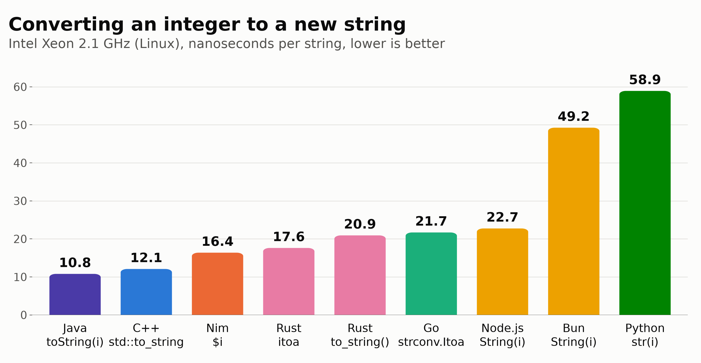
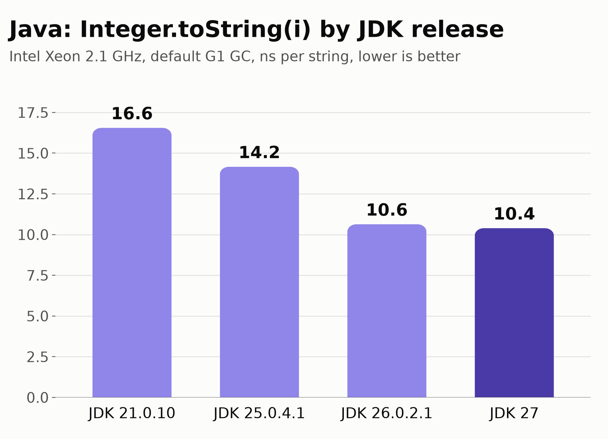

# Java 27 version of the string-creation benchmark

`Bench.java` is a Java port of the benchmark in `post.md`: it converts the integers
0 to 100 million into strings, storing each one in a 1024-slot ring buffer, and
reports the best of five runs after a 1-million-iteration warm-up. The measured
function is:

```java
static void fromInt(int n) {
  final String[] b = buf;
  for (int i = 0; i < n; i++) b[i & 1023] = Integer.toString(i);
}
```

It also times `"" + i` (string concatenation), which runs at the same speed.

`Bench.java` now keeps the elapsed times as `long` and converts only at the final division. The
numbers below were measured with the earlier `double` version. Ten interleaved launches of each
version give the same result within noise, with medians of 10.8 ns (`long`) and 10.6 ns
(`double`). See `why_java_beats_cpp/timing_unpinned.txt`.

## Machine and versions

A cloud VM with 4 vCPUs of an Intel Xeon @ 2.1 GHz, running Ubuntu 24.04. Runs were not
pinned to a core, the same as the M4 Max runs.

OpenJDK 27+35 (GA, default G1 GC), CPython 3.14.7, Node.js 25.9.0, Bun 1.4.2,
Ubuntu clang 18.1.3 with libstdc++, rustc 1.94.1 with itoa, Go 1.24.7, Nim 2.2.12.
For comparison: OpenJDK 21.0.10, Temurin 25.0.4.1, OpenJDK 25.0.2 and OpenJDK 26.0.2.1.

Reproduce with `./run_all.sh` (set `JAVA_HOME` to a JDK 27 install and `PYTHON` to a 3.14
interpreter). Plot with `python plot.py results_linux_xeon.txt strings_linux_java27.png "<subtitle>"`
and `python plot_java.py`.

## Results (ns per string, lower is better)

| Language / call          | Xeon (this run) | Apple M4 Max (post) |
|--------------------------|----------------:|--------------------:|
| **Java 27 `Integer.toString`** | **10.8** | n/a |
| C++ `std::to_string`     | 12.1 | 5.4  |
| Nim `$i`                 | 16.4 | 11.7 |
| Rust `itoa`              | 17.6 | 14.1 |
| Rust `to_string()`       | 20.9 | 15.7 |
| Go `strconv.Itoa`        | 21.7 | 11.9 |
| Node.js `String(i)`      | 22.7 | 13.7 |
| Bun `String(i)`          | 49.2 | 14.6 |
| Python `str(i)`          | 58.9 | 43.6 |



In two more runs, Java 27 took 10.5 to 10.7 ns and C++ took 12.0 to 12.4 ns, so the
order holds.

### Java across JDK releases (`Integer.toString`, ns per string)

| GC       | JDK 21 | JDK 25 | JDK 26 | JDK 27 |
|----------|-------:|-------:|-------:|-------:|
| G1 (default) | 16.6 | 14.2 | 10.6 | **10.4** |
| Parallel | 11.6 | 9.8  | 10.6 | 11.0 |
| Serial   | 11.0 | 8.6  | 12.3 | 12.1 |
| ZGC      | 12.2 | 11.1 | 13.2 | 12.1 |



## Observations

* **Java 27 is the fastest entry on this machine**, a little ahead of C++. Each Java string is
  a new heap object: a `String` plus a Latin-1 `byte[]`, because compact strings are on by
  default. But HotSpot allocates in a thread-local buffer by bumping a pointer, and the
  young-generation collector frees these short-lived objects almost for free. That makes an
  allocation nearly as cheap as C++'s small-string-optimized `std::string`, which never
  allocates at all.
* **The G1 speedup arrived in JDK 26, not 27.** With the default G1 collector, the time drops
  from 16.6 ns (JDK 21) to 14.2 ns (JDK 25) to 10.4 ns (JDK 26), and JDK 27 stays at 10.4-10.6 ns
  (`results_linux_xeon_g1_matrix.txt`). This matches
  [JEP 522](https://openjdk.org/jeps/522) (JDK 26), which cuts G1's post-write barrier on x64
  from about 50 instructions to about 12. This loop runs that barrier on every reference store
  into `buf`.

## What JDK 27 changes in G1, and whether it matters here

JDK 27 has two GC-related JEPs, and neither changes this result:

* [JEP 534](https://openjdk.org/jeps/534), compact object headers by default (12-byte headers
  become 8-byte). This has no effect here. `AllocSize.java` measures 48 bytes per 8-digit string
  with `-XX:+UseCompactObjectHeaders` and with `-XX:-UseCompactObjectHeaders`. Both objects round
  up to 24 bytes either way. The `String` is 12 + 10 bytes of fields = 22 before or 8 + 10 = 18
  after. The `byte[8]` is 16 + 8 = 24 before or 12 + 8 = 20 after. Turning the flag on or off in
  JDK 25, 26 or 27 changes the G1 time by 0.1-0.2 ns, which is noise.
* [JEP 523](https://openjdk.org/jeps/523), G1 is the default everywhere. Before JDK 27, the JVM
  picked Serial on machines with 1 CPU or less than 1792 MB of RAM. This machine has 4 CPUs, so
  G1 was already the default. It matters when pinned to one core (`taskset -c 0`): JDK 25 picks
  Serial and runs at 8.9 ns, while JDK 27 picks G1 and runs at 11.0 ns.

Serial (and Parallel) got *slower* from JDK 25 to 26: Serial went from 8.1-8.3 ns to 11.4 ns.
This is not a vendor-build artifact, because Oracle's JDK 25.0.2 build matches the Temurin one.
The cause has not been investigated.
## Why Java beats C++ here

See [`why_java_beats_cpp/README.md`](why_java_beats_cpp/README.md) for the full investigation,
with machine code, instruction counts and isolating experiments. In short, the digit conversion
in C++ is faster than Java's. What costs C++ is `std::to_string` returning a temporary that then
gets move-assigned into the vector slot. With libstdc++ that means a `memset` call (zero-filling
the new string) and a `memcpy` call (copying the SSO bytes) for every string. HotSpot inlines the
whole `Integer.toString`, writes the digits once into a bump-allocated `byte[]`, and stores a
4-byte reference. As a diagnostic, writing the digits directly into the existing vector slot
(`resize_and_overwrite`) brings C++ down to 6.0 ns. That variant creates no new string, so it
isn't a fair benchmark entry, but it shows that about half of the original C++ time goes to the
temporary and the copy. For the benchmark as defined, a new string each time, Java 27 is faster
on this machine.

## Other observations

* The ranking of the other languages is similar to the M4 Max, except that C++ has a much
  smaller lead. That is probably libstdc++'s `to_string` versus Apple's libc++. Bun's
  `String(i)` also does comparatively worse on this Linux/x64 box.
* The GC rows other than the default vary by about ±1 ns between runs on this shared VM.
  Treat differences that small as noise.
